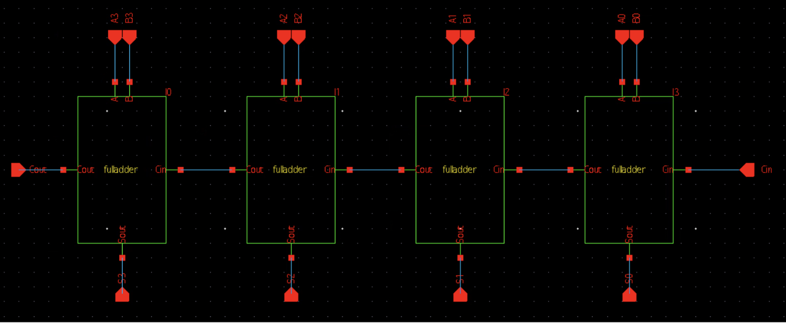
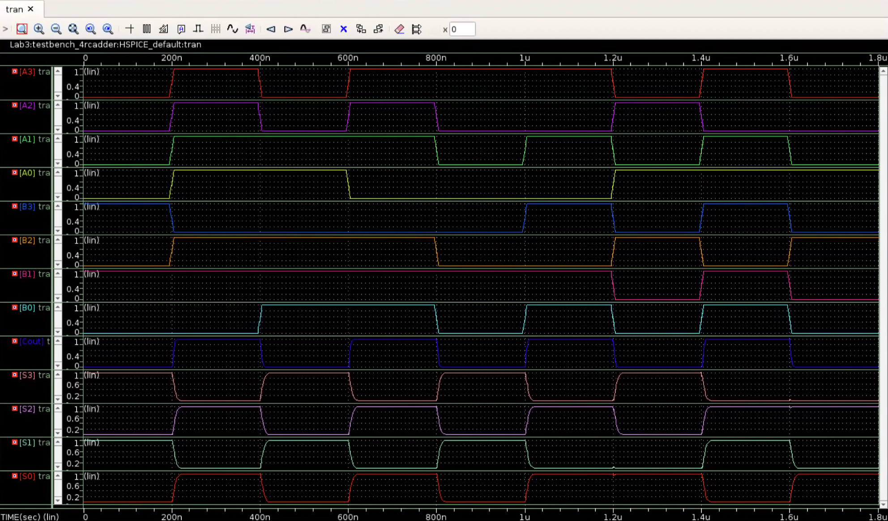
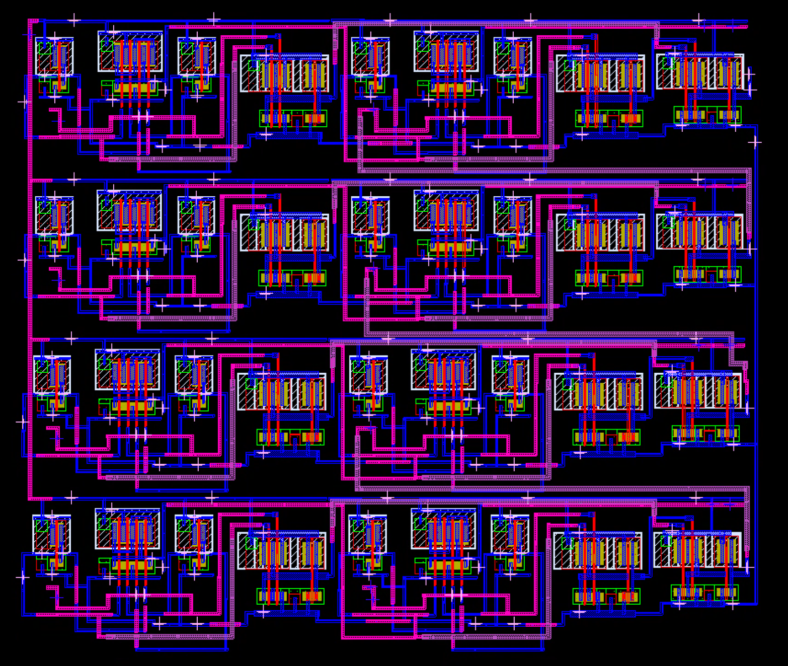

# 4-Bit Ripple Carry Adder

**Rosalie Wessels & Emily Chen**

End-to-end design of a 4-bit ripple carry adder, from schematic to verified physical layout, using Synopsys tools. Built incrementally from a 2-input XOR gate up through a half adder and full adder, with simulation and DRC/LVS verification at each stage.

## Schematic

## Waveform

Waveform simulations verified output against truth tables for the half adder, full adder, and 4-bit ripple carry adder.

## Layout

The layout was built bottom-up: XOR gate, half adder, full adder, and finally the 4-bit ripple carry adder. Area was minimized by stacking full adders vertically, using multiple metal layers to overlap wiring, and routing within existing component bounds where possible. DRC and LVS passed at each stage.

## Design

- 2-input XOR gate (base component)
- Half adder: XOR + AND gate
- Full adder: 2 half adders + OR gate
- 4-bit ripple carry adder: 4 cascaded full adders

## Tools

- Synopsys Custom Compiler (schematic, symbol, layout)
- PrimeWave (transient simulation)
- Git (source control for parallel work
